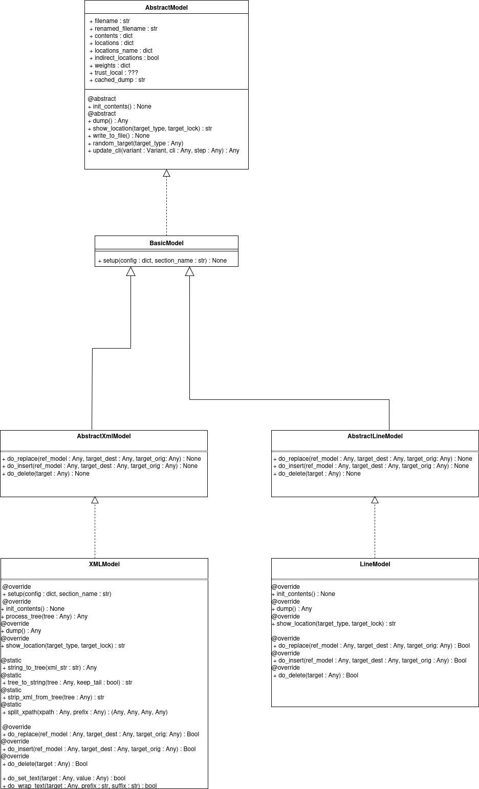
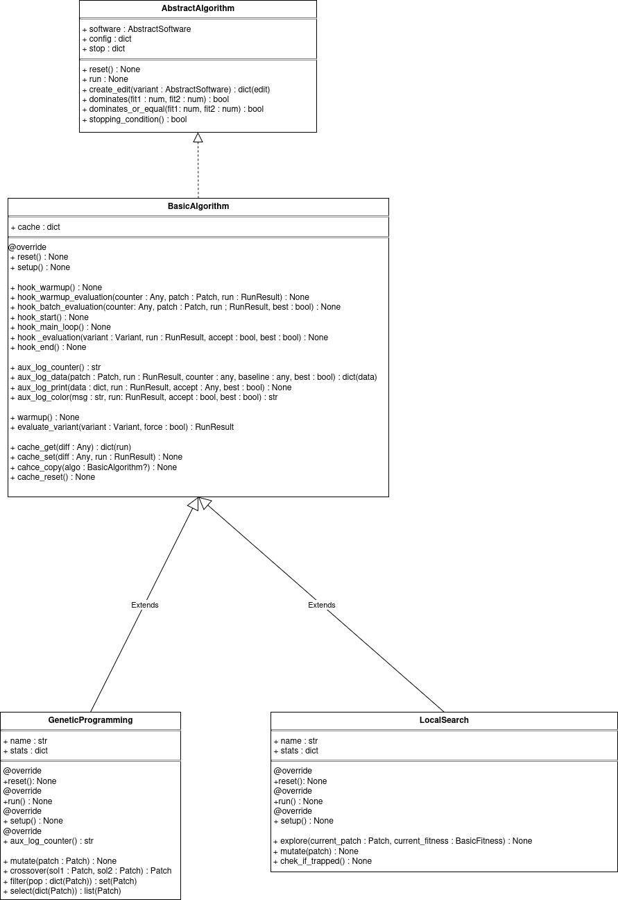
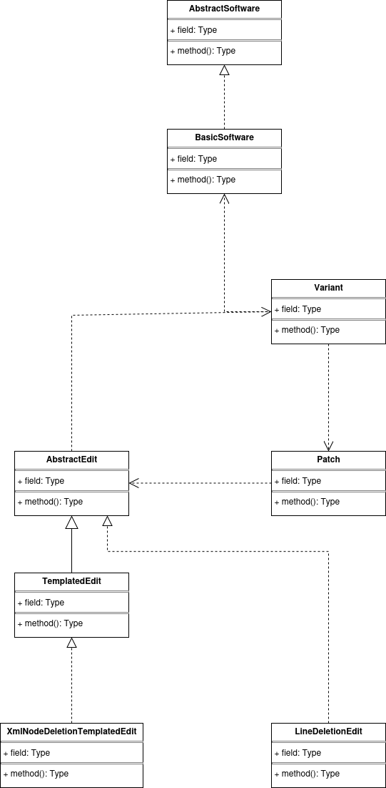
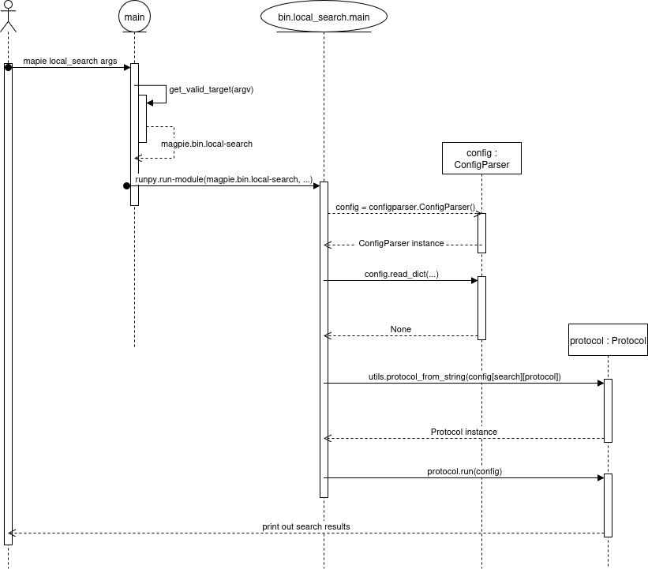
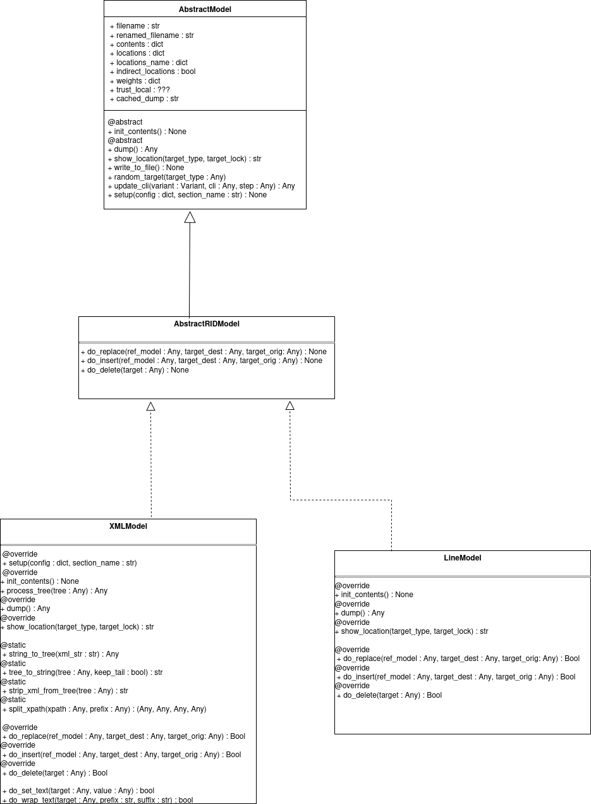

# Study and extension of the Magpie framework : notes

***

### Useful links

Documentation on Magpie's external libraries

[Pathlib Documentation](https://docs.python.org/3/library/pathlib.html)

[Runpy Documentation](https://docs.python.org/3/library/runpy.html)

## Thoughts

***
+ method(): Type
Magpie is a tool for automated software improvement 

To achieve its goal, it provides three functionalities :

 - Ways to turn a given software into an abstract **model** of itself, so we are able to modify it(to apply *edits* 
    on it) efficiently

 - **Algorithms** to look for the best combination of edits(the best *patch*) to apply to a given software

 - **Fitness Functions** to compare multiple versions(multiple *variants*) of a given software on a given criteria( 
   examples of fitness functions include : the amount of **tests** passed by the software, or it's **time complexity**)

Magpie provides the abstract representation and basic methods of those three functionalities, as well the necessary
classes to make them work( we need things like way to represent patches, software, variants, functions to
create and apply edits, etc.) in its *core* folder

Currently, all core classes are in a single folder. This is not a problem *per se,* as it does not impair functionality 
or performance or even testability, but separating data classes from functionality classes would make the project
structure clearer at first glance.

here are the inheritance structure for models and algorithms :



*figure 1 : class diagram illustrating the inheritance structure for models*



*figure 2 : class diagram illustrating the inheritance structure for algorithms*

Data on software evolution is structured in different object types : Edits, Patches, Variants and the software itself 
typed BasicSoftware

An edit is a modification in the software. In code, it contains a  *target*(a variant of software on which the edit 
will apply) and a list of args(I don't know ho they are used yet)

A patch is composed of a list of edits on the same software variant

A variant is a software on which a patch as been applied. It contains a BasicSoftware, a dict called *models*,
but I can't tell what that one is supposed to be, and the last attribute is a called diff, and is a LiteralString. It's
 a value expressing the difference between the variant and another variant of the same software. I would be curious
to know how this value is calculated, there seems to be multiple methods of calculation nad I guess the model used to
make edits is relevant in the calculation as well.

here is a class diagram showing the dependencies listed above



*figure 3 : class diagram for dependencies between data classes*

*We can spot a circular dependency between AbstractEdit, Patch and Variant, which might make unit testing less effective*

Project structure seems close to a visitor pattern : on one side, the data(software, variants, patches, edits), on the 
other, functionality(models of abstraction, editing algorithms, fitness functions). I will need further study to confirm
this

Taking a look at the *bin* folder now, we can see that this the classes contained are meant to parse the magpie command
arguments. As a reminder, magpie currently implements seven different processes :

 - **ablation analysis** I still don't know what this is exactly
 - processes working on produced patches : **minify** and **revalidate**
 - visualisation tools : **show_location** and **show_patch**
 - the currently implemented software evolution algorithm **local_search** and **genetic_programming**, kind of where
 the money is

Knowing which of those classes you will enter when launching magpie is the job of the **\_\_main__** folder at the root
of the project, using the first argument given after launching the magpie project which is the process you want to launch. 
The next arguments you give are the **processes arguments** : things like the path to your scenario file, the exact
evolution algorithm you want to use, the seed for rng edits, etc. It is the *bin* folder classes job to parse those
arguments, put them in a config dict, create the **Protocol** object(class described in *core/basic-protocol.py*) that will 
that will actually be in charge of running the chosen protocol.

Has an example, here is the typical execution flow for the following command :

```bash
    pyhton3 magpie loca_search --scenario examples/minisat/_magpie/scenario_runtime_config1.txt
```



*figure 4 : sequence diagram illustrating the typical execution flow of magpie(part 1).*

Later, we will take a closer look at the Protocol class by illustrating its execution flow using a sequence diagram 
based on the same use case (local search). This will help us visualize a typical execution sequence at the scale 
of the entire project.

Continuing with the bin folder, we can observe a significant amount of duplicated code, which suggests that refactoring 
is possible. The file pairs genetic_programming.py and local_search.py, as well as minify_patch.py and 
revalidate_patch.py, could likely be merged into single files with only minimal code changes. I will discuss this 
further in the Suggestions section. It is also likely that additional refactoring opportunities remain, as a 
considerable amount of duplicated code would still be present even after these changes.

## Suggestions 

***

Here I will report places where the code can be improved and make suggestions for improvements.

### Deleting duplicate class in *model* folder

currently, each model folder contains an abstract representation of said model. Two of those representation, however, 
**are exactly the same classes**, minus their name, as we can see on fig 1. The BasicModel class is also not very useful
and could probably be discarded, if we move the setup method in the AbstractModel class. here is the new structure I 
suggest :



The setup method has been moved up and particular classes for each abstract models have been replaced with a general 
one : AbstractRIDModel(for Abstract Replace Insert Delete Model) that the classes for concrete models can implement. We
thus get rid of duplicate classes and make the structure clearer.

I also noticed that the astor model implements the RID model but does not inherit it. With this structure, no need to
create a new abstract class, we can just make the class inherit the AbstractRIDModel class. That is also true of all
future classes implementing this model.

### Refactoring in the *bin* folder

The bin folder files are in charge of parsing the arguments of the protocol chosen by the user and build the 
corresponding Protocol object. Currently, the folder is structured as follows :

```
magpie
├── algos
├── bin
│   ├── __init__.py
│   ├── ablation_analysis.py
│   ├── genetic_programming.py
│   ├── local_search.py
│   ├── minify_patch.py
│   ├── revalidate_patch.py
│   ├── show_locations
│   └── show_patch
├── core
.
.
.
├──__main__.py
.
.
```

When looking at the code, we notice a lot of redundancy. The genetic_programming.py and local_search.py are almost the 
same, having only a few lines of difference, and the same goes for minify_patch.py and revalidate_patch.py. In both of 
those cases we could easily merge them in a single file each, with only minimal code change in the newly created files
and the \_\_main__.py root file. Here is the new structure I suggest :

```
magpie
├── algos
├── bin
│   ├── __init__.py
│   ├── software_improvement.py
│   ├── patch_operations.py
│   └── visualizer.py
├── core
.
.
.
├──__main__.py (updated)
.
.
```

Here I also combined the show_location.py and show_patch.py into the visualizer.py file This refactor would trim down 
the code considerably, going from 7 to 3 files while keeping the file size mostly the same and getting rid of a lot
of duplicate code. Furthermore, this change would make the structure clearer by putting the different protocols into
three distinct categories : the automatic software improvement protocols, the protocols making operations on patches,
and the visualization protocols.


### Separating responsibilities in the BasicAlorithm class

*Single responsibility* is one of the basic rules for good design in software engineering. The single responsibility
of the BasicAlgorithm class should be to provide the operations necessary to run a search algorithm, but by looking at
the code, I noticed that it does a lot more than that.

The setup method for example, is part of the `BasicAlgorithm` object's build process, and could easily be done by the
`Protocol` object calling a function in the setup.py file.

The *hook* methods in that class are pretty confusing. When starting my study I thought those where supposed to run the
search algorithm, turns out they are just logging, checking for errors and printing the report datas. I suggest moving them into their own
separate class and document it to make their purpose more clear, and the `BasicAlgorithm` code easier to understand.


The main problem with this refactor is that some of the currently implemented search algorithm override the hook methods present in `BasicSoftware`. A simple solution to this, however, is to create an inner class that would inherit the basic `Hook` class(we could even rename it `BasicHook`), and give the search algorithm an object of this class instead. As an example, here is what the code of `ValidSearch` would look like :

```python
class ValidSearch(LocalSearch):

   class ValidSearchHook(BasicHook):

      def __init__():
         super.init()

      def hook_warmup(self, algo):
         super().hook_warmup()
         if algo.debug_patch is None:
               raise RuntimeError

      def hook_start(self, algo):
         super().hook_start()
         algo.report['best_fitness'] = None
         algo.report['best_patch'] = self.debug_patch

      def hook_evaluation(self, algo, variant, run, accept=False, best=False):
         # accept
         accept = best = False
         if run.status == 'SUCCESS':
               best = algo.dominates(run.fitness, algo.report['best_fitness']) or (run.fitness == algo.report['best_fitness'] and len(variant.patch.edits) < len(algo.report['best_patch'].edits))
               accept = best or run.fitness == algo.report['best_fitness']
               if best:
                  algo.report['best_fitness'] = run.fitness
                  algo.report['best_patch'] = variant.patch

         super().hook_evaluation(variant, run, accept, best)

        # next
        self.stats['steps'] += 1

    def __init__(self):
         super().__init__()
         self.debug_patch = None
         self.hook = ValidSearchHook()


    def do_cleanup(self, variant):
         cleaned = copy.deepcopy(variant)
         for k in reversed(range(len(variant.patch.edits))):
            patch = copy.deepcopy(cleaned.patch)
            del patch.edits[k]
            tmp = magpie.core.Variant(self.software, patch)
            if tmp.diff == variant.diff:
                self.software.logger.info('removed %s', cleaned.patch.edits[k])
                cleaned = tmp
         s1, s2 = len(cleaned.patch.edits), len(variant.patch.edits)
         if s1 < s2:
            self.software.logger.info('cleaned size is %d (was %d)', s1, s2)
            self.software.logger.info('clean patch: %s', cleaned.patch)
         return cleaned
```

Another challenge of this refactor is that the hook operations need access to the search algorithm's data to work. As you can see up here, I solved this by making the hook methods take a search algorithm as argument, turning the class into a **visitor-like utility**. This makes for more decoupling, but will introduce more verbose, as the method call in the algo will now require it to pass itself : 
```python 
#from
self.hook_wramup()

#to
self.hook.warmup(self)
```

This change will definitely make the code a bit more laborious to write, however it will make it a lot 
clearer and easier to understand.

### Evaluation pipelines attributes in `BasicSoftware`

The `BasicSofwtare` class is responsible for the execution of it's own evaluation pipeline

We know that the pipeline consists of five commands: `init`, `setup`, `compile`, `test` and `run`. Each of those commands have 
four attributes : 
 - `cmd` : the command itself
 - `performed` : a boolean value indicating if the command as been performed yet or not
 - `timeout` : a time limit for the command's execution
 - `lengthout` : a length limit for the command's output

Currently, the `BasicAlgorithm` class is reserving one field for each attribute, for each command, for a total of twenty
fields reserved for the evaluation pipeline. Having this much resembling fields introduces a lot of code redundancy,
most notably in the setup section of the class initialization :

```python
        if 'init_cmd' in config['software']:
            if config['software']['init_cmd'].lower() in ['', 'none']:
                self.init_cmd = None
            else:
                self.init_cmd = config['software']['init_cmd']
        if 'init_timeout' in config['software']:
            if config['software']['init_timeout'].lower() in ['', 'none']:
                self.init_timeout = None
            else:
                self.init_timeout = float(config['software']['init_timeout'])
        if 'init_lengthout' in config['software']:
            if config['software']['init_lengthout'].lower() in ['', 'none']:
                self.init_lengthout = None
            else:
                self.init_lengthout = int(config['software']['init_lengthout'])
```

This piece of code is repeated five times, with the only change being the attribute's name. There is two ways to fix 
this :

 - Having a dict field for each command

```python
#from
self.setup_performed = False
self.setup_cmd = None
self.setup_timeout = None
self.setup_lengthout = None

#to
self.setup = {
    'performed' : False,
    'cmd' : None,
    'timeout' : None,
    'lengthout' : None
}
```

 - Creating a `Command` data class

```python
class Command :

    def __init__(self): 
        self.performed = False,
        self.cmd = None,
        self.timeout = None,
        self.lengthout = None
```

In both cases, these changes would allow us to factorize the init code(and other not mentioned pieces) into a separate
method to which we would simply pass the right command attribute.

In my opinion this refactor would make the code shorter and clearer(Keep It Simple Stupid), and more scalable.
In particular, the data class option would make it a lot easier to add a new command in the pipeline.

### Misc

 - At core/abstract_model.py 75 : method update-cli does nothing. Could be removed
 - In the BasicProtocol class : a few minor changes can be made. Most importantly : the software attribute is not needed,
    as it is used only to be passed to the search attribute. Why not pass the software to the search algo as an attribute
    *before* creating the protocol with the search attribute?
 - In the `BasicAlgorithm` class, the setup method mostly just processes and copies data from its config argument and
    checks for errors in aforementioned data. This means data duplication. Instead of doing that, we could do all the 
    processing and error checking on the protocol's `config['search']` dictionary, and pass a reference to it to the 
    `BasicAlgorithm` object as an attribute. As a whole, it would be good if every part of the execution sequence read 
    and modified a single `config` dict, making copies only when strictly necessary, as useless copies induce errors
    and data duplication
 - I noticed some occurrences of dead variables in the code, most notably in the `BasicAlgorithm` class(signaled by comments). 
    Variables and dict values are assigned, then re-assigned later without being used once. These make the code 
    more confusing and induce errors.


***

### Questions

 - What does it mean to sync the evaluation directory?
 

### Todo

 - make a full class diagram of the project to clarify which design pattern is best to use, why, and how to apply it.
 - read on design patterns
 - take a closer look at the execution sequence for the run() method in the Protocol class.
 - read on algorithm evolution techniques : start with genetic programming and try to find a new one to implement 
    myself